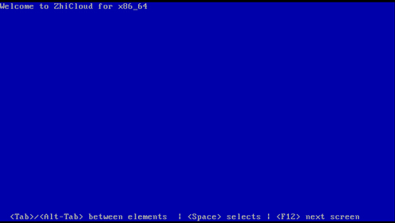
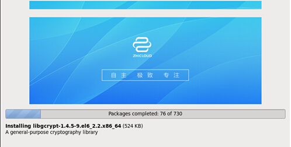
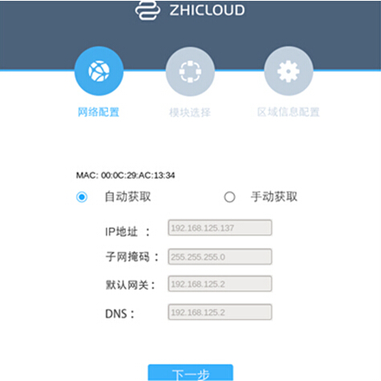
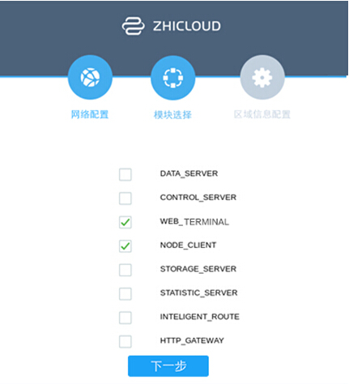
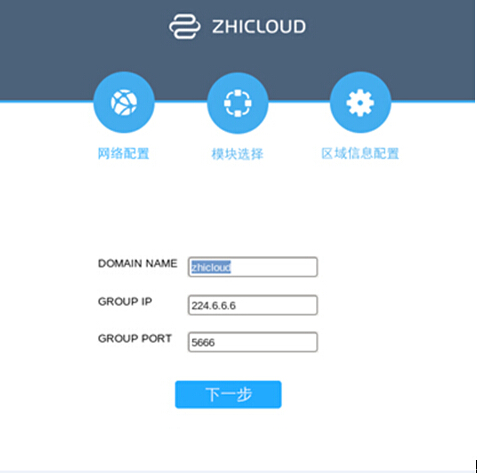
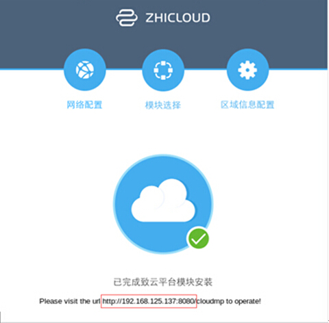

#　　　　云平台多节点quick install
　　　　　　　　　　　　　　　　　　　　　　　　　　　　　　　　　　　　　　　　　　　　　　　　

本文档用于帮助新用户，在私有云解决方案下，搭建多节点情况下的致云云管理平台。  
致云云管理平台总共包含7个区分功能的模块。它们协同工作，为你提供高可靠、高弹性的Iaas云环境。在私有云解决方案下，除了根据需求选择需要安装的平台模块外，还需要选择模块如何分布于服务器。根据搭建云管理平台时所需服务器情况可以分为All in one和多节点安装。All in one主要用于云管理平台功能演示，它将所有的平台模块安装在一台服务器上，安装文档详见"All in one安装手册"。而生产环境中为了充分发挥云管理平台的功能及性能，需要采用多节点模式。该模式下各个平台模块分布于多个服务器。  
本文档帮助你搭建多节点情况下的致云云管理平台。请根据你具体的私有云解决方案在各个服务器安装相应的平台模块，安装了各个平台模块的服务器集群即可构建一套完整的云管理平台。
　　　　　　　　　　　　　　　　　　　　　　　　　　　　　　　　　　　　　　　　　　
　　　　　　　　　　　　　　　　　　　　　　　　　　　　　　　　　　　　　　　
　　　　　　　　　　　　　　　　　　　　　　　　　　　　　　　　　　　　　
　　　　　　　　　　　　　　　　　　　　　　　　　　　　　　　　　　　　　　
　　　　　　　　　　　　　　　　　　　　　　　　　　　　　　　　　　　　　
　　　　　　　　　　　　　　　　　　　　　　　　　　　　　　　　　　　　　　
　　　　　　　　　　　　　　　　　　　　　　　　　　　　　　　　　　　
　　　　　　　　　　　　　　　　　　　　　　　　　　　　　　　　　　　　　　　　　　　　
　　　　　　　　　　　　　　　　　　　　　　　　　　　　　　　　　　　　　　　　
　　　　　　　　　　　　　　　　　　　　　　　　　　　　　　　　　　　　　　　　　　　　　
　　　　　　　　　　　　　　　　　　　　　　　　　　　　　　　　　　　　　　　　　
　　　　　　　　　　　　　　　　　　　　　　　　　　　　　　　　　　　　　　　　　　　　　　
　　　　　　　　　　　　　　　　　　　　　　　　　　　　　　　　　　　　　　　　　　　　
　　　　　　　　　　　　　　　　　　　　　　　　　　　　　　　　　　　　　　　　
　　　　　　　　　　　　　　　　　　　　　　　　　　　　　　　　　　　　　　　　　　　
　　　　　　　　　　　　　　　　　　　　　　　　　　　　　　　　　　　　　　　　　
　　　　　　　　　　　　　　　　　　　　　　　　　　　　　　　　　　　　　　　　
　　　　　　　　　　　　　　　　　　　　　　　　　　　　　　　　　　　　　　　　　
　　　　　　　　　　　　　　　　　　　　　　　　　　　　　　　　　　　　　　　　　　
　　　　　　　　　　　　　　　　　　　　　　　　　　　　　　　　　　　　　　　　　　　　
　　　　　　　　　　　　　　　　　　　　　　　　　　　　　　　　　　　　　　　　　　
　　　　　　　　　　　　　　　　　　　　　　　　　　　　　　　　　　　　　　　　　　　
　　　　　　　　　　　　　　　　　　　　　　　　　　　　　　　　　　　　　　　　
　　　　　　　　　　　　　　　　　　　　　　　　　　　　　　　　　　　　　　　　
　　　　　　　　　　　　　　　　　　　　　　　　　　　　　　　　　　　　　　　　　　　　
　　　　　　　　　　　　　　　　　　　　　　　　　　　　　　　　　　　　　　　　　　　
　　　　　　　　　　　　　　　　　　　　　　　　　　　　　　　　　　
　　　　　　　　　　　　　　　　　　　　　　　　　　　　　　　　　　　　　　　　　　　　　
　　　　　　　　　　　　　　　　　　　　　　　　　　　　　　　　　　　　　　　　　　　
　　　　　　　　　　　　　　　　　　　　　　　　　　　　　　　　　　　　　　　　　　　　　　　　　　　　
## 安装准备
　　　　　　　　　　　　　　　　　　　　　　　　　　　　　　　　　　　　　　　　　　　　　　　　

请根据你的私有云解决方案，准备所需数量的物理服务器。服务器配置要求取决于其上安装的平台模块。具体的硬件配置说明详见附录1。  
请准备安装工具：致云云管理平台安装盘或者致云云管理平台的安装ISO镜像文件。
可以通过以下三种途径来安装致云云管理平台。
 
- **光驱**
- USB
- BMC

### 光驱

在服务器上插入云管理平台安装光盘，在服务器启动时选择从光驱启动。
### USB

在服务器上插入存储了云管理平台安装ISO镜像文件的USB,在服务器启动时选择从USB启动。　
### BMC

通过服务器BMC地址，输入账号密码进入服务器管理界面。通过java控制台远程控制服务器。从本地选择致云云管理平台的安装ISO镜像文件加载光驱。
　　　　　　　　　　　　　　　　　　　　　　　　　　　　　　　　　　　　　　　　　　　
　　　　　　　　　　　　　　　　　　　　　　　　　　　　　　　　　　　　　　　　　
　　　　　　　　　　　　　　　　　　　　　　　　　　　　　　　　　　　　　　　　
　　　　　　　　　　　　　　　　　　　　　　　　　　　　　　　　　　　　　　　
　　　　　　　　　　　　　　　　　　　　　　　　　　　　　　　　　　　　　　　
　　　　　　　　　　　　　　　　　　　　　　　　　　　　　　　　　　　　　　　　　
　　　　　　　　　　　　　　　　　　　　　　　　　　　　　　　　　　　　　　　　　　　
　　　　　　　　　　　　　　　　　　　　　　　　　　　　　　　　　　　　　　　　　
　　　　　　　　　　　　　　　　　　　　　　　　　　　　　　　　　　　　　　　　　　　
　　　　　　　　　　　　　　　　　　　　　　　　　　　　　　　　　　　　　　　　　　　
　　　　　　　　　　　　　　　　　　　　　　　　　　　　　　　　　　　　　　　　　
　　　　　　　　　　　　　　　　　　　　　　　　　　　　　　　　　　　　　　　　　　　　
　　　　　　　　　　　　　　　　　　　　　　　　　　　　　　　　　　　　　　　　
　　　　　　　　　　　　　　　　　　　　　　　　　　　　　　　　　　　　　　　　　　
　　　　　　　　　　　　　　　　　　　　　　　　　　　　　　　　　　　　　　　　　
　　　　　　　　　　　　　　　　　　　　　　　　　　　　　　　　　　　　　　　　
　　　　　　　　　　　　　　　　　　　　　　　　　　　　　　　　　　　　　　　　
　　　　　　　　　　　　　　　　　　　　　　　　　　　　　　　　　　　　　　　　　
　　　　　　　　　　　　　　　　　　　　　　　　　　　　　　　　　　　　　　　　　
　　　　　　　　　　　　　　　　　　　　　　　　　　　　　　　　　　　　　　　　　　　

## 安装流程
　　　　　　　　　　　　　　　　　　　　　　　　　　　　　　　　　　　　　　　　　　

安装流程分为以下5步:

1. 基准系统安装
2. 配置服务器网络信息
3. 选择安装模块
4. 配置通信域信息
5. 安装完成

　　　　　　　　　　　　　　　　　　　　　　　　　　　　　　　　　　　　　　　　　　
　　　　　　　　　　　　　　　　　　　　　　　　　　　　　　　　　　　　　　　
　　　　　　　　　　　　　　　　　　　　　　　　　　　　　　　　　　　　　　　　
　　　　　　　　　　　　　　　　　　　　　　　　　　　　　　　　　　　　　　　　　
　　　　　　　　　　　　　　　　　　　　　　　　　　　　　　　　　　　　　　　　　　　　　
　　　　　　　　　　　　　　　　　　　　　　　　　　　　　　　　　　　　　　　　
　　　　　　　　　　　　　　　　　　　　　　　　　　　　　　　　　　　　　　　　　　　　　　　　
　　　　　　　　　　　　　　　　　　　　　　　　　　　　　　　　　　　　　　　　　　　　　
　　　　　　　　　　　　　　　　　　　　　　　　　　　　　　　　　　　　　　　　　　　　　　　　
　　　　　　　　　　　　　　　　　　　　　　　　　　　　　　　　　　　　　　　　　
　　　　　　　　　　　　　　　　　　　　　　　　　　　　　　　　　　　　　　　　　　
　　　　　　　　　　　　　　　　　　　　　　　　　　　　　　　　　　　　　　　　　　　　　　　　　
　　　　　　　　　　　　　　　　　　　　　　　　　　　　　　　　　　　　　　　　　　　　　　　
　　　　　　　　　　　　　　　　　　　　　　　　　　　　　　　　　　　　　　　　　
　　　　　　　　　　　　　　　　　　　　　　　　　　　　　　　　　　　　　　　　　　　
　　　　　　　　　　　　　　　　　　　　　　　　　　　　　　　　　　　　　　　　　　　
　　　　　　　　　　　　　　　　　　　　　　　　　　　　　　　　　　　　　　　　　　　　
　　　　　　　　　　　　　　　　　　　　　　　　　　　　　　　　　　　　　　　　　　　　　　　　
　　　　　　　　　　　　　　　　　　　　　　　　　　　　　　　　　　　　　　　　　　　　　　　　　　　　　　　　　　　　　　　　　　　　
　　　　　　　　　　　　　　　　　　　　　　　　　　　　　　　　　　　　　　　　　　　
　　　　　　　　　　　　　　　　　　　　　　　　　　　　　　　　　　　　　　　　　　
　　　　　　　　　　　　　　　　　　　　　　　　　　　　　　　　　　　　　　　　　　
　　　　　　　　　　　　　　　　　　　　　　　　　　　　　　　　　　　　　　　　　　　　　
　　　　　　　　　　　　　　　　　　　　　　　　　　　　　　　　　　　　　　　
　　　　　　　　　　　　　　　　　　　　　　　　　　　　　　　　　　　　　　　　　
　　　　　　　　　　　　　　　　　　　　　　　　　　　　　　　　　　　　　　　
　　　　　　　　　　　　　　　　　　　　　　　　　　　　　　　　　　　　　　　　
　　　　　　　　　　　　　　　　　　　　　　　　　　　　　　　　　　　　　　　　　
　　　　　　　　　　　　　　　　　　　　　　　　　　　　　　　　　　　　　　　　　　
　　　　　　　　　　　　　　　　　　　　　　　　　　　　　　　　　　　　　　　　　　　　
　　　　　　　　　　　　　　　　　　　　　　　　　　　　　　　　　　　　　　　　　　　
　　　　　　　　　　　　　　　　　　　　　　　　　　　　　　　　　　　　　　　　

### 基准系统安装

当你通过以上任意一种方式进行安装，进入以下界面后，点击回车，开始安装由致云定制的操作系统。

以上过程持续约20分钟，请你耐心等待。  
基准系统安装完毕后服务器会自动重启。
重启后的系统默认的用户名和密码是root/123456

  
  
  
  
　　　　　　　　　　　　　　　　　　　　　　　　　　　　　　　　　　　　　　　　　　　　　　　　
　　　　　　　　　　　　　　　　　　　　　　　　　　　　　　　　　　　　　　　　　
　　　　　　　　　　　　　　　　　　　　　　　　　　　　　　　　　　　　　　
　　　　　　　　　　　　　　　　　　　　　　　　　　　　　　　　　　　　　　　　　　　　
　　　　　　　　　　　　　　　　　　　　　　　　　　　　　　　　　　　　　　　　　　
　　　　　　　　　　　　　　　　　　　　　　　　　　　　　　　　　　　　　　　　
　　　　　　　　　　　　　　　　　　　　　　　　　　　　　　　　　　　　　　　　　　　　
　　　　　　　　　　　　　　　　　　　　　　　　　　　　　　　　　　　　　　　　　
　　　　　　　　　　　　　　　　　　　　　　　　　　　　　　　　　　　　　　　　　　
　　　　　　　　　　　　　　　　　　　　　　　　　　　　　　　　　　　　　　　　　　　
　　　　　　　　　　　　　　　　　　　　　　　　　　　　　　　　　　　　　　　　　　　

### 配置服务器网络信息

首先需要配置服务器的网络信息，网络信息包括：IP地址、子网掩码、默认网关和DNS地址。  
可以通过手动设置或DHCP自动获取两种方式来配置服务器网络信息。默认使用DHCP自动获取的方式。

　　　　　　　　　　　　　　　　　　　　　　　　　　　　　　　　　　　　　　　　　
　　　　　　　　　　　　　　　　　　　　　　　　　　　　　　　　　　　　　　　
　　　　　　　　　　　　　　　　　　　　　　　　　　　　　　　　　　　　　　　　　
　　　　　　　　　　　　　　　　　　　　　　　　　　　　　　　　　　　　　　　　
　　　　　　　　　　　　　　　　　　　　　　　　　　　　　　　　　　　　　　　
　　　　　　　　　　　　　　　　　　　　　　　　　　　　　　　　　　　　　　　　
　　　　　　　　　　　　　　　　　　　　　　　　　　　　　　　　　　　　　　　　　
　　　　　　　　　　　　　　　　　　　　　　　　　　　　　　　　　　　　　　　　
　　　　　　　　　　　　　　　　　　　　　　　　　　　　　　　　　　　　　　
　　　　　　　　　　　　　　　　　　　　　　　　　　　　　　　　　　　　　　　　
　　　　　　　　　　　　　　　　　　　　　　　　　　　　　　　　　　　　　　　　
　　　　　　　　　　　　　　　　　　　　　　　　　　　　　　　　　　　　　　　　　
　　　　　　　　　　　　　　　　　　　　　　　　　　　　　　　　　　　　　　
　　　　　　　　　　　　　　　　　　　　　　　　　　　　　　　　　　　　　　　　　　　　
　　　　　　　　　　　　　　　　　　　　　　　　　　　　　　　　　　　　　　　　　　　
　　　　　　　　　　　　　　　　　　　　　　　　　　　　　　　　　　　　　　　　　　
　　　　　　　　　　　　　　　　　　　　　　　　　　　　　　　　　　　　　
　　　　　　　　　　　　　　　　　　　　　　　　　　　　　　　　　　　　　　　　　　

### 选择安装模块

请根据具体的私有云解决方案，选择在该服务器上所需安装的致云云管理平台模块，各个模块的功能详见附录2。  
除此之外，web管理端模块提供了管理云平台的图形化管理界面。特别注意：搭建致云云管理平台时，至少要部署一个Web管理端，否则无法对平台进行管理。

　　　　　　　　　　　　　　　　　　　　　　　　　　　　　　　　　　　　　　　
　　　　　　　　　　　　　　　　　　　　　　　　　　　　　　　　　　　　　　　　　
　　　　　　　　　　　　　　　　　　　　　　　　　　　　　　　　　　　　　　　　
　　　　　　　　　　　　　　　　　　　　　　　　　　　　　　　　　　　　　　　
　　　　　　　　　　　　　　　　　　　　　　　　　　　　　　　　　　　　　　　　　　
　　　　　　　　　　　　　　　　　　　　　　　　　　　　　　　　　　　　　　　　
　　　　　　　　　　　　　　　　　　　　　　　　　　　　　　　　　　　　　　　　
　　　　　　　　　　　　　　　　　　　　　　　　　　　　　　　　　　　　　　　
　　　　　　　　　　　　　　　　　　　　　　　　　　　　　　　　　　　　　　　　　　　　　
　　　　　　　　　　　　　　　　　　　　　　　　　　　　　　　　　　　　　　　　　　　　　
　　　　　　　　　　　　　　　　　　　　　　　　　　　　　　　　　　　　　　　
　　　　　　　　　　　　　　　　　　　　　　　　　　　　　　　　　　　　　　
　　　　　　　　　　　　　　　　　　　　　　　　　　　　　　　　　　　　　　　　
　　　　　　　　　　　　　　　　　　　　　　　　　　　　　　　　　　　　　　　　　　　　　　　　　　　
　　　　　　　　　　　　　　　　　　　　　　　　　　　　　　　　　　　　　　　　　
　　　　　　　　　　　　　　　　　　　　　　　　　　　　　　　　　　　　　　
　　　　　　　　　　　　　　　　　　　　　　　　　　　　　　　　　　　　　　　　

### 配置通信域信息

致云云管理平台中的各个模块以通信域的方式工作。在同一通信域下的各个模块可以相互通信，进而协同工作。通信域由域名、组播地址和组播端口来标识。注册到同一通信域下的各模块自动识别，构成一套完整的平台。  
请确定服务器上安装的平台模块所属的通信域。通信域默认域名domain name为zhicloud，默认组播地址group ip为224.6.6.6，默认组播端口group port为5666。建议使用默认信息。

　　　　　　　　　　　　　　　　　　　　　　　　　　　　　　　　　　　　　　
　　　　　　　　　　　　　　　　　　　　　　　　　　　　　　　　　　　　　　　
　　　　　　　　　　　　　　　　　　　　　　　　　　　　　　　　　　　　　　
　　　　　　　　　　　　　　　　　　　　　　　　　　　　　　　　　　　　　　　　　　　　
　　　　　　　　　　　　　　　　　　　　　　　　　　　　　　　　　　　　　　　
　　　　　　　　　　　　　　　　　　　　　　　　　　　　　　　　　　　　　
　　　　　　　　　　　　　　　　　　　　　　　　　　　　　　　　　　　　　
　　　　　　　　　　　　　　　　　　　　　　　　　　　　　　　　　　　　　
　　　　　　　　　　　　　　　　　　　　　　　　　　　　　　　　　　　　　　
　　　　　　　　　　　　　　　　　　　　　　　　　　　　　　　　　　　　　　　
　　　　　　　　　　　　　　　　　　　　　　　　　　　　　　　　　　　　　　　
　　　　　　　　　　　　　　　　　　　　　　　　　　　　　　　　　　　　　　　
　　　　　　　　　　　　　　　　　　　　　　　　　　　　　　　　　　　　　
　　　　　　　　　　　　　　　　　　　　　　　　　　　　　　　　　　　　　　　
　　　　　　　　　　　　　　　　　　　　　　　　　　　　　　　　　　　　　　
　　　　　　　　　　　　　　　　　　　　　　　　　　　　　　　　　　　　　　　　　

### 安装完成

出现以下页面时，云平台模块已经安装完成并且自动启动。在多台服务器分别安装成功后，你已经成功搭建了一台属于你的致云云管理平台。  
请根据页面中提示的云平台web管理端的IP地址和端口（图中http://192.168.125.137:8080），使用默认用户名密码（superadmin/superadmin）登陆网页后，使用云管理平台。

　　　　　　　　　　　　　　　　　　　　　　　　　　　　　　　　　　　　　　　　　
　　　　　　　　　　　　　　　　　　　　　　　　　　　　　　　　　　　　　　　　
　　　　　　　　　　　　　　　　　　　　　　　　　　　　　　　　　　　　　　　
　　　　　　　　　　　　　　　　　　　　　　　　　　　　　　　　　　　　　　
　　　　　　　　　　　　　　　　　　　　　　　　　　　　　　　　　　　　　　　
　　　　　　　　　　　　　　　　　　　　　　　　　　　　　　　　　　　　　　
　　　　　　　　　　　　　　　　　　　　　　　　　　　　　　　　　　　　　　　　　　
　　　　　　　　　　　　　　　　　　　　　　　　　　　　　　　　　　　　　　　　
　　　　　　　　　　　　　　　　　　　　　　　　　　　　　　　　　　　　　　　
　　　　　　　　　　　　　　　　　　　　　　　　　　　　　　　　　　　　　　　
　　　　　　　　　　　　　　　　　　　　　　　　　　　　　　　　　　　　　　　
　　　　　　　　　　　　　　　　　　　　　　　　　　　　　　　　　　　　　
　　　　　　　　　　　　　　　　　　　　　　　　　　　　　　　　　　　　　　　
　　　　　　　　　　　　　　　　　　　　　　　　　　　　　　　　　　　　　　
　　　　　　　　　　　　　　　　　　　　　　　　　　　　　　　　　　　　　　
　　　　　　　　　　　　　　　　　　　　　　　　　　　　　　　　　　　　　　　　
　　　　　　　　　　　　　　　　　　　　　　　　　　　　　　　　　　　　　　　　　

# 附录1 服务器硬件配置说明　　　　　
<table>
<tbody>
<tr><td>服务器</td><td>配置项</td><td>最低配置</td><td>推荐配置</td></tr>
<tr><td>data server</td><td>cpu</td><td>2</td><td>4</td></tr>
<tr><td></td><td>内存</td><td>16G</td><td>32G</td></tr>
<tr><td></td><td>磁盘</td><td>50G</td><td>100G</td></tr>
<tr><td></td><td>网卡</td><td>1000M*2</td><td>1000M*2</td></tr>
<tr><td>control server</td><td>cpu</td><td>2</td><td>4</td></tr>
<tr><td></td><td>内存</td><td>16G</td><td>32G</td></tr>
<tr><td></td><td>磁盘</td><td>50G</td><td>100G</td></tr>
<tr><td></td><td>网卡</td><td>1000M*2</td><td>1000M*2</td></tr>
<tr><td>storage server</td><td>cpu</td><td>4</td><td>12</td></tr>
<tr><td></td><td>内存</td><td>32G</td><td>96G</td></tr>
<tr><td></td><td>磁盘</td><td>3TB</td><td>24TB</td></tr>
<tr><td></td><td>网卡</td><td>1000M*2</td><td>1000M*4</td></tr>
<tr><td>statistic server</td><td>cpu</td><td>2</td><td>4</td></tr>
<tr><td></td><td>内存</td><td>16G</td><td>32G</td></tr>
<tr><td></td><td>磁盘</td><td>1TB</td><td>12TB</td></tr>
<tr><td></td><td>网卡</td><td>1000M*2</td><td>1000M*2</td></tr>

<tr><td>node client</td><td>cpu</td><td>12</td><td>36</td></tr>
<tr><td></td><td>内存</td><td>48G</td><td>128G</td></tr>
<tr><td></td><td>磁盘</td><td>1TB</td><td>12TB</td></tr>
<tr><td></td><td>网卡</td><td>1000M*2</td><td>1000M*2</td></tr>
</tbody>
</table>
　　　　　　　　　　　　　　　　　　　　　　　　　　　　　　　　　　　　　　　　　　　　　
　　　　　　　　　　　　　　　　　　　　　　　　　　　　　　　　　　　　　　　
　　　　　　　　　　　　　
　　　　　　　　　　　　　　　　　　　　　　
# 附录2 云平台模块功能说明

- data server：通信域管理模块。致云云管理平台中的各个模块以通信域的方式工作，注册到同一通信域下的各模块自动识别，构成一套完整的平台。data server负责整个通信域的注册鉴权。
- control server：主控模块。它负责向各个工作模块发送控制命令。
- storage server：镜像管理模块。虚拟机需要操作系统才能工作，由storage server管理的光盘镜像和磁盘镜像以两种方式来为虚拟机提供操作系统。
- node client：计算资源节点模块。它是本地存储以及虚拟机资源的实际载体。
- intelligent router：智能路由模块。它相当于一个路由器，用于网络连接至虚拟机。
- statistic server：统计服务器模块，统计整个平台内虚拟资源、物理资源的用量。 
- http gateway：网关模块，它将平台内部的控制接口（control server）作为标准HTTP接口提供出来，由此利用web来进行平台图形化管理。

